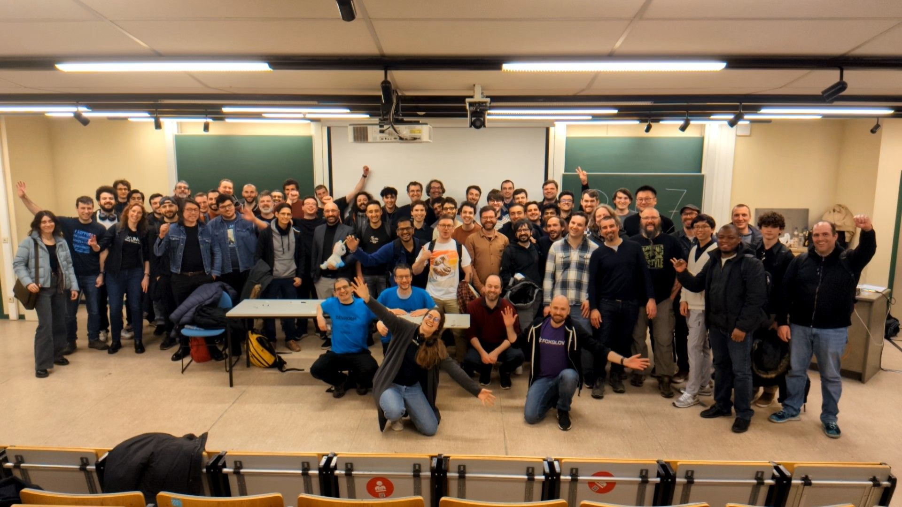

  ---
layout: page
title: FOSDEM 2026
---

# Second edition of the Robotics and Simulation devroom at FOSDEM 2026

# Stats

* Date: Saturday, January 31, 2026
* Format: Full-day event
* 22 Talks
  * 2 Long talks (40min + 5 min Q&A)
  * 11 Medium length talks (20 min + 5 min Q&A)
  * 4 Short talks (10 min)
  * 5 Lightning talks (5 min)
* No of speakers: 29

# Call for Papers

* [Call for Papers 2026](https://robotics-devroom.github.io/cfp/fosdem26)

# Schedule

* [Schedule 2026](https://archive.fosdem.org/2026/schedule/track/robotics-and-simulation/)

Video recordings can be found on the individual talk pages.  

# Summaries of this event

TODO: add summaries
